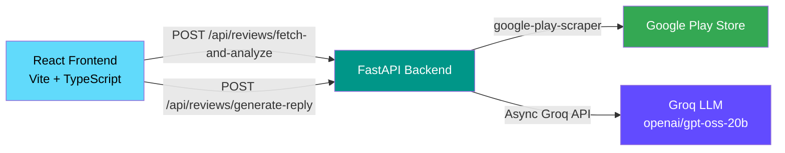

# Google Play Review Analyzer

AI-powered tool that scrapes Google Play Store reviews, classifies them by sentiment and priority using Groq LLM, and generates suggested developer replies — all through a clean Kanban-style interface.

🔗 **Try it live:** [google-play-review-analyzer.onrender.com](https://google-play-review-analyzer.onrender.com/)

---

## Architecture



> **Note:** This app is fully stateless — there is no database. Reviews are scraped on-demand from the Google Play Store, analyzed by the LLM in real-time, and returned to the frontend. Nothing is persisted between requests.

---

## How It Works

### Customizable Prompts

Every AI call uses a **3-part prompt architecture**:

| Part | Who controls it | Purpose |
|------|----------------|---------|
| **Header** (fixed) | Backend | Defines the task and enforces JSON output format |
| **Instructions** (custom) | User via frontend | Optional extra context/rules for domain-specific tuning |
| **Footer** (fixed) | Backend | Appends the review text and output schema |

The backend owns the system prompt structure — users can only inject guidance into the middle section. This means the AI always returns valid structured JSON, while users can fine-tune behavior to their app's domain. For example:

- Sentiment: *"Reviews about pricing alone should be neutral, not negative."*
- Priority: *"Crash reports and login issues must always be high priority."*
- Reply: *"Always start by addressing the user by name. Be empathetic and direct."*

---

### Route 1 — Fetch & Analyze Reviews

**`POST /api/reviews/fetch-and-analyze`**

This is the main endpoint. When you paste a Google Play URL and click "Analisar agora":

1. **Scrape reviews** — The backend parses the URL to extract the app ID, language, and country. It then uses the `google-play-scraper` library to fetch up to 25 reviews (configurable via `MAX_REVIEWS_TO_FETCH`).

2. **AI analysis (concurrent)** — For each review, two Groq LLM calls run in parallel using `asyncio.gather`:
   - **Sentiment classification** → `positive`, `neutral`, or `negative`
   - **Priority classification** → `high`, `medium`, or `low`

   Both calls use JSON schema enforcement (strict mode) to guarantee valid structured output. All calls run concurrently, so analyzing 25 reviews takes roughly the same time as analyzing one.

3. **Kanban board** — The frontend displays reviews in three columns (Positive / Neutral / Negative) sorted by priority. You can drag-and-drop reviews between columns to reclassify them.

Users can optionally provide custom **sentiment instructions** and **priority instructions** through the "Configurações da IA" panel before running the analysis.

### Route 2 — Generate AI Reply

**`POST /api/reviews/generate-reply`**

When you click "Gerar resposta com IA" on a specific review:

1. The backend sends the reviewer's name and review text to Groq with instructions to write a professional, empathetic developer reply.
2. The LLM is told to greet the user by name, acknowledge their feedback, and keep the response under 3 sentences in the same language as the review.
3. The suggested reply appears in an editable text area — you can edit it, copy it, or regenerate it.

Users can optionally provide custom **reply instructions** (e.g., tone, language, specific rules) before generating each response.

---

## Tech Stack

| Layer | Technology |
|-------|-----------|
| **Frontend** | React 19, TypeScript, Vite, Tailwind CSS v4, TanStack React Query |
| **Backend** | FastAPI, Pydantic v2, Uvicorn |
| **AI** | Groq API (`openai/gpt-oss-20b` model) with async client |
| **Scraping** | `google-play-scraper` (Python) |
| **Deployment** | Docker on Render (single container: FastAPI serves the built React frontend as static files) |

---

## Running Locally

### Prerequisites

- [Python 3.12+](https://www.python.org/downloads/)
- [uv](https://docs.astral.sh/uv/) (Python package manager)
- [Node.js 20+](https://nodejs.org/)
- [pnpm](https://pnpm.io/)
- A [Groq API key](https://console.groq.com/keys)

### Setup

1. **Clone the repo** and open it in VS Code.

2. **Install backend dependencies:**
   ```bash
   cd backend
   uv sync
   ```

3. **Install frontend dependencies:**
   ```bash
   cd frontend
   pnpm install
   ```

4. **Configure environment variables:**

   Copy `backend/.env.example` to `backend/.env` and add your Groq API key:
   ```bash
   cp backend/.env.example backend/.env
   ```
   
   Edit `backend/.env`:
   ```
   GROQ_API_KEY=your-groq-api-key-here
   ```

5. **Start both servers** by pressing `Ctrl + Shift + B` in VS Code — this runs the backend (FastAPI on port 8000) and frontend (Vite dev server on port 5173) in parallel.

   Or start them manually in two terminals:
   ```bash
   # Terminal 1 — Backend
   cd backend
   uv run uvicorn app.main:app --reload

   # Terminal 2 — Frontend
   cd frontend
   pnpm dev
   ```

6. Open [http://localhost:5173](http://localhost:5173) in your browser.

---

## API Docs

When running locally, the FastAPI auto-generated docs are available at:

- **Swagger UI:** [http://localhost:8000/docs](http://localhost:8000/docs)
- **ReDoc:** [http://localhost:8000/redoc](http://localhost:8000/redoc)
