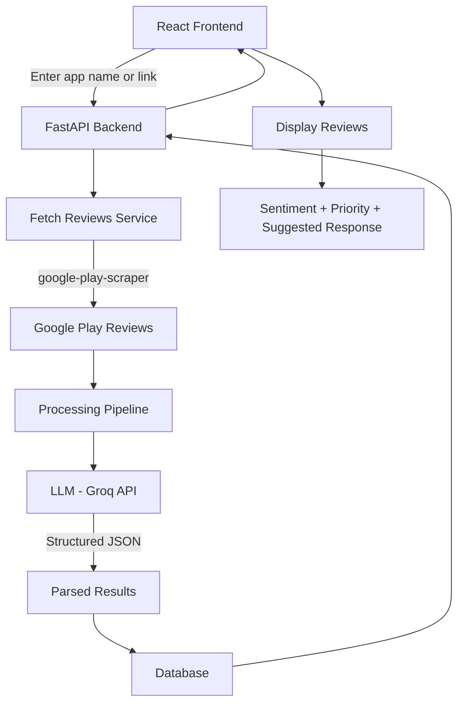

Full-stack app (React + FastAPI)
Input: app link/name from Google Play
Use google-play-scraper to fetch reviews

Run LLM (via Groq) to:
classify sentiment
assign priority
generate suggested response (JSON output)

UI shows reviews + AI suggestions (editable)

Future: use AWS Lambda to:
periodically fetch new reviews
detect new ones
notify user

---

part 1(no aws)

create react + vite application. fastapi with uv. 
seerve frontend as static. deploy on render